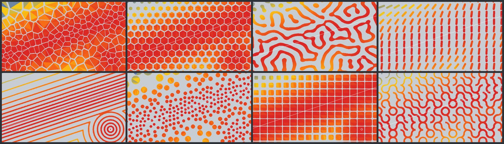

# Attractor Patterns for Blender

Twenty-one Geometry Nodes pattern modifiers that put perforations, textures and cutouts on any object, driven by point and line attractors.

**Tutorial and downloads:** https://siatohi80.github.io/attractor-patterns-blender-_addon/

- Add-on (Blender 4.2+): [docs/download/attractor_patterns-0.2.0.zip](docs/download/attractor_patterns-0.2.0.zip). Install it with **Edit › Preferences › Get Extensions › ⌄ › Install from Disk**.
- Asset library, no add-on needed: [docs/download/attractor_patterns.blend](docs/download/attractor_patterns.blend)

Same patterns in the browser: [2D playground](https://siatohi80.github.io/attractor-patterns-site/). For Rhino: [Grasshopper plug-in](https://siatohi80.github.io/pattern-plugin_Grasshopper/).

Free software under GPL-3.0-or-later.
